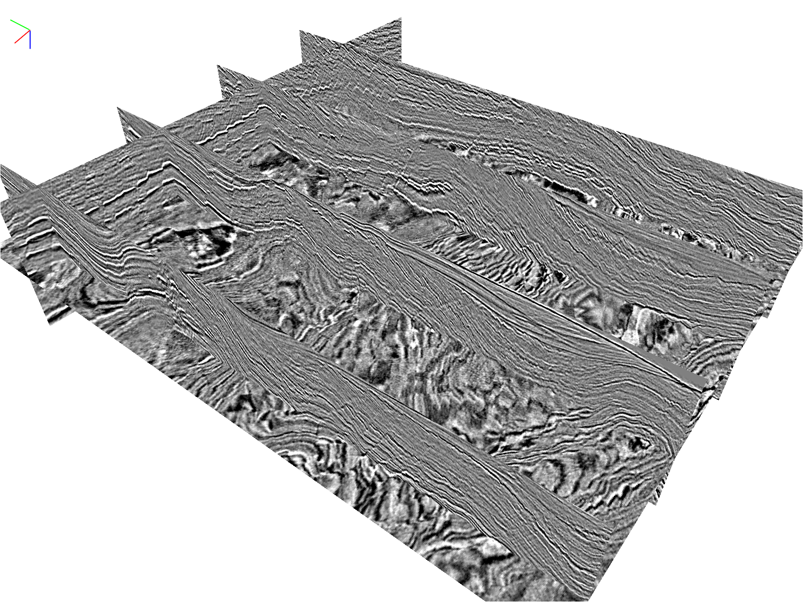
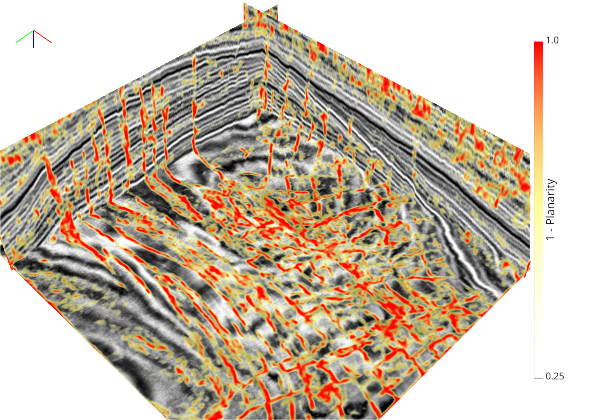

Seismic Canvas: interactive 3D seismic visualization tool
-----------------------------------------------------

Seismic Canvas is an interactive 3D visualization tool mainly designed for seismic data, at the same time also can be useful for any 3D data.
This tool is based on [VisPy](https://github.com/vispy/vispy), a Python library that leverages the computational power of GPUs through the **OpenGL** library.

Usage
--------

**Slicing**: add any number of slices to view the slices of your volume using `seismic_canvas.volume_slices` function. For example:
```python
visual_nodes = volume_slices(volume,
  x_pos=[370, 170, 570, 770], y_pos=810, z_pos=120, clim=(-2, 2))
```



**Camera**: left click and drag to rotate the camera angle; right click and drag, or scroll mouse wheel, to zoom in and out. Hold 'Shift' key, left click and drag to pan move. Press space button to return to the initial view. Press 'S' button to save a screenshot PNG file at any time.


**Dragging**: most elements are draggable. Hold 'Ctrl', the selectable visual nodes will be highlighted when your mouse hovers over them; left click and drag to move the highlighted visual node. The volume slices will update their contents in real-time during dragging.


**MemMap**: compatible to [numpy memory map](https://docs.scipy.org/doc/numpy/reference/generated/numpy.memmap.html). For example, reading in a binary data file contatining a 3D seismic volume with size 210x920x825 (608MB), Seismic Canvas takes ~700MB RAM (Windows PyQt5 backend).
```python
volume = np.fromfile('./CostaRica_seismic.dat', '>f4').reshape(825, 920, 210)
```
Instead, reading in the same file using numpy memory map, Seismic Canvas takes only ~82MB RAM (Windows PyQt5 backend), and significantly reduces the launch time.
```python
volume = np.memmap('./CostaRica_seismic.dat', dtype='>f4',
                   mode='r', shape=(825, 920, 210))
```

**Reproducibility**: when you arrange everything on the canvas, press 'A' to print out a collection of useful parameters that can be used to reproduce the current canvas setting.


Dependencies
------------

Seismic Canvas depends on **numpy** and **vispy** Python libraries.
You can install them through
```
pip install numpy vispy
```

The **vispy** library also depends on one of these backends to display a window on your OS: PyQt4/PySide, PyQt5/PySide2, glfw, pyglet, SDL, or wx.
We recommend PyQt5 as it is the easiest to install and most compatible on different platforms.
```
pip install PyQt5
```

Demo
----

See [`simple_demo.py`](./simple_demo.py) for a simple demo. [`vispy/util/fetching.py`](https://github.com/vispy/vispy/blob/master/vispy/util/fetching.py) will automatically download this example data.


Also try [`osv_F3_demo.py`](./osv_F3_demo.py) to check out the results from this research: [xinwucwp/osv](https://github.com/xinwucwp/osv). You can download all the binary data volumes from this [Google Drive link](https://drive.google.com/drive/folders/1SqEOYIi6MV0PNKazuZ50R_qjLA0VWBM7?usp=sharing).




A dark themed example with a z-axis-up axis legend:

